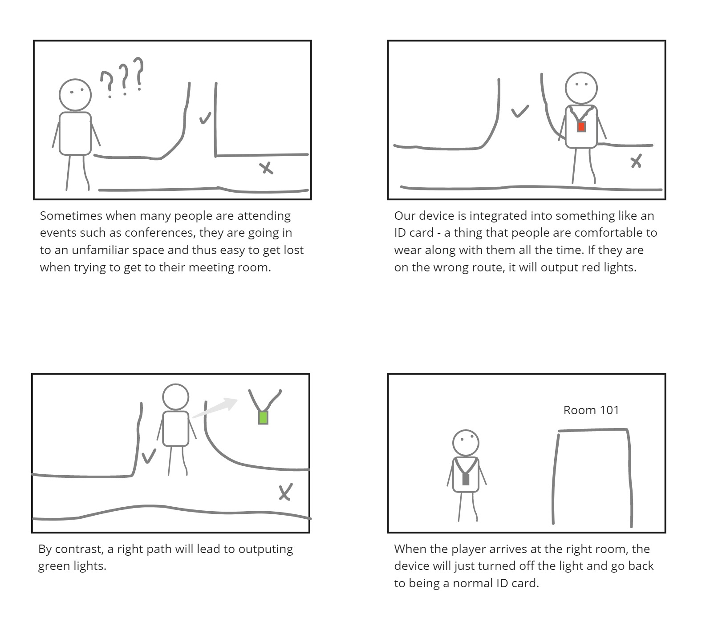
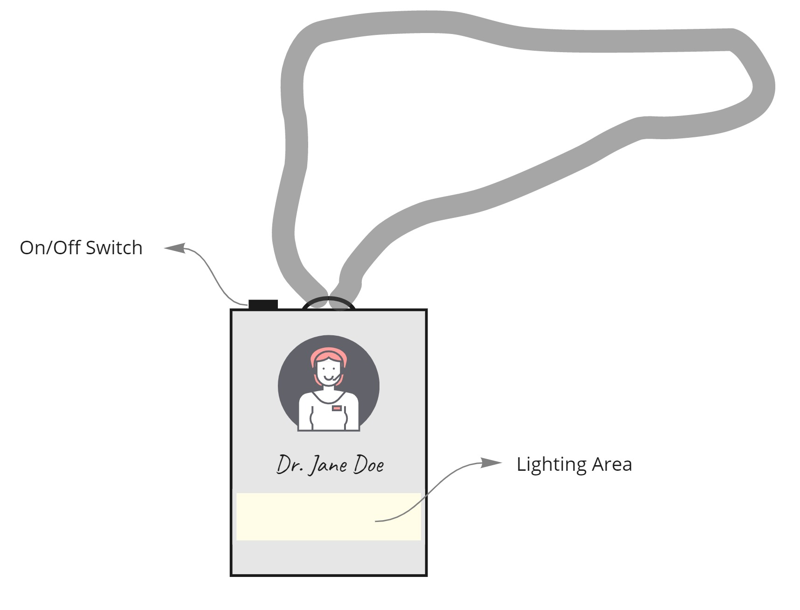
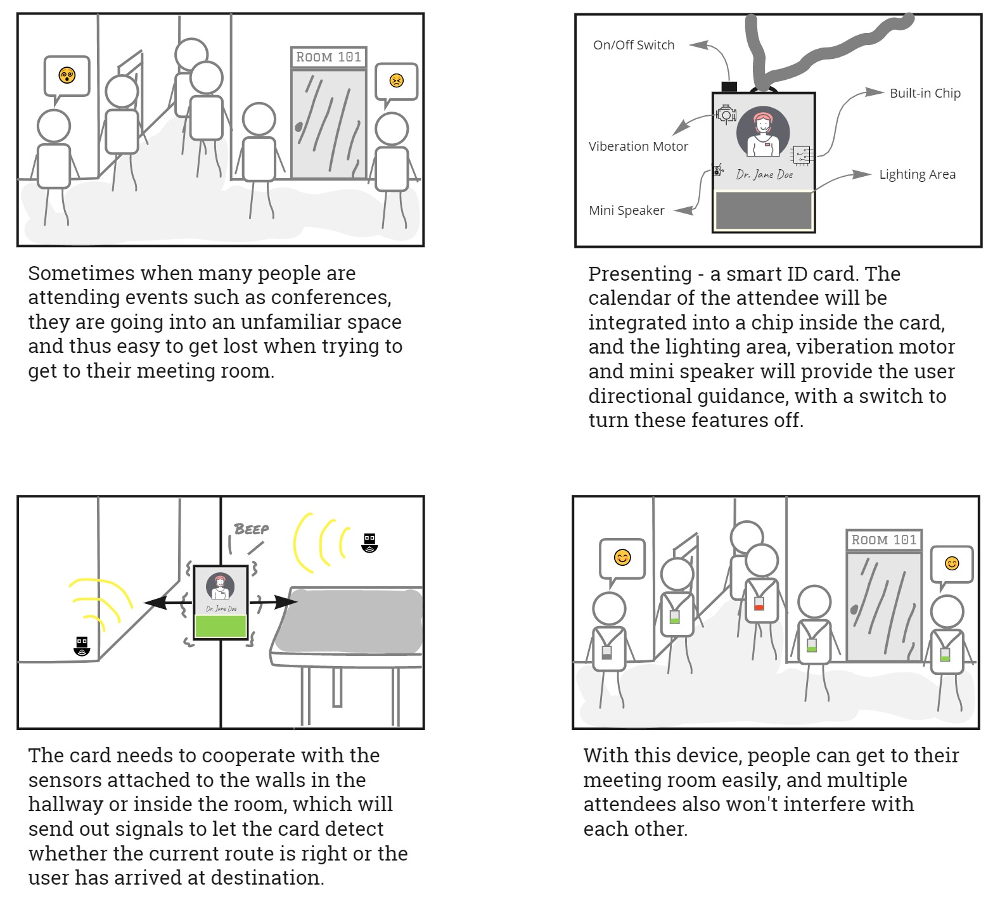

# Staging Interaction

In the original stage production of Peter Pan, Tinker Bell was represented by a darting light created by a small handheld mirror off-stage, reflecting a little circle of light from a powerful lamp. Tinkerbell communicates her presence through this light to the other characters. See more info [here](https://en.wikipedia.org/wiki/Tinker_Bell). 

There is no actor that plays Tinkerbell--her existence in the play comes from the interactions that the other characters have with her.

For lab this week, we draw on this and other inspirations from theatre to stage interactions with a device where the main mode of display/output for the interactive device you are designing is lighting. You will plot the interaction with a storyboard, and use your computer and a smartphone to experiment with what the interactions will look and feel like. _Make sure you read all the instructions and understand the whole of the laboratory activity before starting!_

## Prep

1. Set up [your Github "Lab Hub" repository](../../../) by [following these instructions](https://github.com/FAR-Lab/Developing-and-Designing-Interactive-Devices/blob/2021Spring/readings/Submitting%20Labs.md).
2. Set up the README.md for your Hub repository (for instance, so that it has your name and points to your own Lab 1) and [learn how](https://guides.github.com/features/mastering-markdown/) to post links to your submissions on your readme.md so we can find them easily.

### For lab, you will need:

1. Paper
1. Markers/ Pen
1. Smart Phone--Main required feature is that the phone needs to have a browser and display a webpage.
1. Computer--we will use your computer to host a webpage which also features controls
1. Found objects and materials--you’ll have to costume your phone so that it looks like some other device. These materials can include doll clothes, a paper lantern, a bottle, human clothes, a pillow case. Be creative!
1. Scissors

### Deliverables for this lab are: 
1. Storyboard
1. Sketches/photos of costumed device
1. Any reflections you have on the process.
1. Video sketch of the prototyped interaction.
1. Submit these in the lab1 folder of your class [Github page], either as links or uploaded files. Each group member should post their own copy of the work to their own Lab Hub, even if some of the work is the same for each person in the group.

## Overview
For this assignment, you are going to 

A) [Plan](#part-a-plan) 

B) [Act out the interaction](#part-b-act-out-the-interaction) 

C) [Prototype the device](#part-c-prototype-the-device)

D) [Wizard the device](#part-d-wizard-the-device) 

E) [Costume the device](#part-e-costume-the-device)

F) [Record the interaction](#part-f-record)

## The Report
This readme.md page in your own repository should be edited to include the work you have done. You can delete everything but the headers and the sections between the **stars**. Write the answers to the questions under the starred sentences. Include any material that explains what you did in this lab hub folder, and link it in the readme.

Labs are due on Mondays. Make sure this page is linked to on your main class hub page.

## Part A. Plan 

To stage the interaction with your interactive device, think about:

_Setting:_ Where is this interaction happening? (e.g., a jungle, the kitchen) When is it happening?

_Players:_ Who is involved in the interaction? Who else is there? If you reflect on the design of current day interactive devices like the Amazon Alexa, it’s clear they didn’t take into account people who had roommates, or the presence of children. Think through all the people who are in the setting.

_Activity:_ What is happening between the actors?

_Goals:_ What are the goals of each player? (e.g., jumping to a tree, opening the fridge). 

The interactive device can be anything *except* a computer, a tablet computer or a smart phone, but the main way it interacts needs to be using light.

**Describe your setting, players, activity and goals here.**

:point_down::point_down::point_down::point_down::point_down:

The interaction happens when buildings hold events with many sub-events happening at the same time in different rooms. For example, a university can hold a conference with multiple workshops focusing on different topics.

Players include attendees and all kinds of other people, such as students going to classes, staff members, etc. The activities between the players can be crossing paths with each other, talking, etc.

The goals for the each attendee will be trying to get to the right room in an environment that they are not familiar with.

:point_up::point_up::point_up::point_up::point_up:

Sketch a storyboard of the interactions you are planning. It does not need to be perfect, but must get across the behavior of the interactive device and the other characters in the scene. 

**Include a picture of your storyboard here**

:point_down::point_down::point_down::point_down::point_down:

:point_up::point_up::point_up::point_up::point_up:

Present your idea to the other people in your breakout room. You can just get feedback from one another or you can work together on the other parts of the lab.

**Summarize feedback you got here.**

:point_down::point_down::point_down::point_down::point_down:

I was in a breakout room discussion together with Yimeng Sun, Renzhi Hu, Panda Xu and Songyu Du.

For the feedback, Most of the people agreed that this sounds like a solid plan. One person asked that whether I'm going to use GPS to let the device detect whether it's on the right path, which I think is a great question that I haven't considered yet. I answered that GPS is probably not precise enough with regard to paths inside a building and I might be attaching sensors in the hallways to make the detection instead.

:point_up::point_up::point_up::point_up::point_up:

## Part B. Act out the Interaction

Try physically acting out the interaction you planned. For now, you can just pretend the device is doing the things you’ve scripted for it. 

**Are there things that seemed better on paper than acted out?**

:point_down::point_down::point_down::point_down::point_down:

One thing is that seeing the color of the device is a little inconvenient because it sort of needs people to constantly look down to check on their ID card if people are wearing it as the way in the storyboard. But people could also hold the device in their hands though.

:point_up::point_up::point_up::point_up::point_up:

**Are there new ideas that occur to you or your collaborators that come up from the acting?**

:point_down::point_down::point_down::point_down::point_down:

A few ideas came up to me:

- When the players need to make a turn, there could be a blinking in the device to indicate the need.
- Some players may don't need the instructions at all and find the light distracting, so there should be an off switch on the device.
- If two players with the same destination encounters each other on the road, a special color of light (maybe yellow) can show up to help people connect.
- Just notice that Tinkerbelle allows sound outputs as well, so it would be nice to play a sound when the players are on the wrong road or arrive at the right room.

:point_up::point_up::point_up::point_up::point_up:

## Part C. Prototype the device

You will be using your smartphone as a stand-in for the device you are prototyping. You will use the browser of your smart phone to act as a “light” and use a remote control interface to remotely change the light on that device. 

Code for the "Tinkerbelle" tool, and instructions for setting up the server and your phone are [here](https://github.com/FAR-Lab/tinkerbelle).

We invented this tool for this lab! 

**Give us feedback on Tinkerbelle.**

:point_down::point_down::point_down::point_down::point_down:

The Tinkerbelle is pretty easy to use, the only thing I realized is that if I use it on the mobile phone and click on the Jane Wren tab by mistake, the screen won't switch after I then click on the Tinkerbelle tab.

:point_up::point_up::point_up::point_up::point_up:

## Part D. Wizard the device
Take a little time to set up the wizarding set-up that allows for someone to remotely control the device while someone acts with it. Hint: You can use Zoom to record videos, and you can pin someone’s video feed if that is the scene which you want to record. 

**Include your first attempts at recording the set-up video here.**

:point_right: Video link: https://drive.google.com/file/d/1-V8bnlsDRJjPn8rBvO_fSeKd7Ofz8s5w/view?usp=sharing :point_left:

Now, hange the goal within the same setting, and update the interaction with the paper prototype. 

**Show the follow-up work here.**

:point_right: Video link: https://drive.google.com/file/d/1bwHcqkKigwgRSM8nUfWb4pDPhLTvWtb-/view?usp=sharing :point_left:

## Part E. Costume the device

Only now should you start worrying about what the device should look like. Develop a costume so that you can use your phone as this device.

Think about the setting of the device: is the environment a place where the device could overheat? Is water a danger? Does it need to have bright colors in an emergency setting?

**Include sketches of what your device might look like here.**

:point_down::point_down::point_down::point_down::point_down:

:point_up::point_up::point_up::point_up::point_up:

**What concerns or opportunities are influencing the way you've designed the device to look?**

:point_down::point_down::point_down::point_down::point_down:

- The lighting area shouldn't be overlapped with the name or photo area for readability.
- In the meantime, the lighting area shouldn't be too small either, it will be inconvenient if people need to search for the position of the light.
- We shouldn't expect all people will need the assistance of our device, so people should be able to turn off the light easily.
- The device itself should be something that is not too heavy to wear or take, so I think an ID card will be the most ideal appearence.

:point_up::point_up::point_up::point_up::point_up:

## Part F. Record

**Take a video of your prototyped interaction.**

:point_right: Video link: https://drive.google.com/file/d/1Ik77Sy0Y9uvC13G0kTo6ALQJdQQV_Thp/view?usp=sharing :point_left:

**Please indicate anyone you collaborated with on this Lab.**
Be generous in acknowledging their contributions! And also recognizing any other influences (e.g. from YouTube, Github, Twitter) that informed your design. 

:point_down::point_down::point_down::point_down::point_down:

I was in a breakout room discussion together with Yimeng Sun, Renzhi Hu, Panda Xu and Songyu Du. A big thank you to all of them for providing the feedback and discuss ideas with me.

:point_up::point_up::point_up::point_up::point_up:

# Staging Interaction, Part 2 

This describes the second week's work for this lab activity.

## Prep (to be done before Lab on Wednesday)

You will be assigned three partners from another group. Go to their github pages, view their videos, and provide them with reactions, suggestions & feedback: explain to them what you saw happening in their video. Guess the scene and the goals of the character. Ask them about anything that wasn’t clear. 

**Summarize feedback from your partners here.**

:point_down::point_down::point_down::point_down::point_down:

Yimeng Sun, Renzhi Hu, Panda Xu and Songyu Du provided me these valuable feedbacks:

- The person wearing the ID card faces towards others, so the person might not see the light himself. May be better if change the user story, instead of navigating, to telling others (e.g. a security guard) that the person went into the wrong way.
- Location tracking might not be so accurate in a building.
- It's not clear how to set up the destination. It’s pretty often that people in a conference have to go back and forth between multiple rooms (More than one person gave me similar feedback).
- The ID card can be connected with phone and embed more features, such as cashless payment, meet up with others, etc.
- Maybe I can get rid of the upper part and simply make the whole badge as a big screen and display the user's name and picture digitally.

:point_up::point_up::point_up::point_up::point_up:

## Make it your own

Do last week’s assignment again, but this time: 
1) It doesn’t have to (just) use light, 
2) You can use any modality (e.g., vibration, sound) to prototype the behaviors, 
3) We will be grading with an emphasis on creativity. 

**Document everything here.**

:point_down::point_down::point_down::point_down::point_down:

After Part 1, I've updated my previous idea, and here's the new storyboard:

Several considerations about the device:

- As mentioned previously, GPS probably won't work very well with regard to the indoor environment. Thus I decided to attach transmitters to walls in hallways or rooms to send out signals that will be received by the sensor combined with the chip in the ID card to detect the correct route/destination.
- I didn't use the suggestion about including more features, connecting with phone or making the whole thing a big digital screen, because I still want this device to be light and simple.
- It could be hard to see the lighting area while wearing the ID card, so I added sound and vibration effects for convenience. The lighting feature was kept for people with hearing disabilities, and other people such as security member can also see the light and provide directional guidance if the user is on the wrong route.
- Attendees usually have several meetings in a day at different locations, so the chip of the ID card will store calendar information attached specifically to this user and provide guidance accordingly.

The new prototype video:

https://drive.google.com/file/d/1zkbOh_78jRn8DLKngoUiz2seBXF5fTh0/view?usp=sharing

:point_up::point_up::point_up::point_up::point_up:
